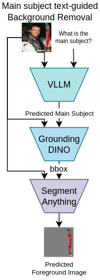
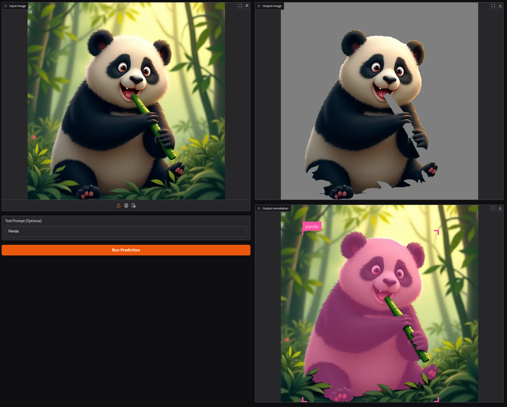

# Segment Main Subject

## Introduction

Segment Main Subject uses a combination of LLM and image segmentation models to identify and segment the main subjects in an image. The application leverages Vision LLM, Grounding DINO and SAM to predict masks of the main subjects in images. This project is built on [Language Segment-Anything](https://github.com/luca-medeiros/lang-segment-anything).



## Installation

1. Clone the repository:
```bash
git clone https://github.com/mc-marcocheng/Segment-Main-Subject
cd Segment-Main-Subject
```

2. Install the required packages:
- Option 1 (with `pip`):
```bash
pip install -r requirements.txt
```
- Option 2 (with `uv`):
```bash
uv sync
```

## Running the Application
Once you have completed the installation steps, if you plan to not provide any text hints to the model, you need to run a Vision LLM:

```bash
CUDA_VISIBLE_DEVICES=0 vllm serve google/gemma-3-4b-it --max-seq-len 1024 --max-model-len 1024 --gpu-memory-utilization .95
```
You can change `google/gemma-3-4b-it` into any other VLLM model. You can tune the `--gpu-memory-utilization` parameter to adjust the memory usage.

Then run the application:

With `pip`:
```bash
CUDA_VISIBLE_DEVICES=1 python gradio_app.py
```

With `uv`:
```bash
CUDA_VISIBLE_DEVICES=1 uv run gradio_app.py
```
Change `CUDA_VISIBLE_DEVICES` to the GPU you want to use.

Open http://localhost:8765/gradio to use the demo application in your browser.


